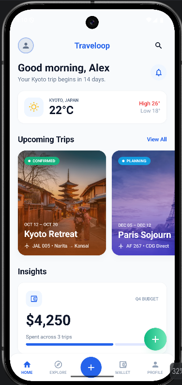
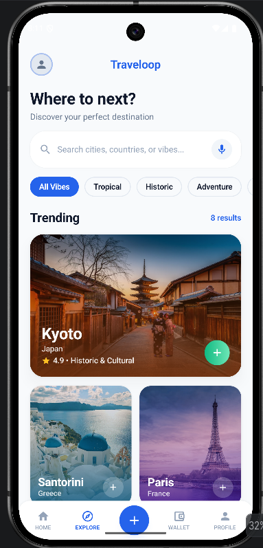

# 🌍 Traveloop

> Your ultimate travel companion for exploring, planning, and managing trips flawlessly. ✈️

Traveloop is a beautiful, modern Android application built entirely with **Jetpack Compose**. It aims to solve the modern traveler's problems by offering an all-in-one suite to discover trending destinations, book experiences, manage trip budgets, and organize digital travel documents . 

## 📸 Screenshots

<p align="center">
  
  &nbsp;&nbsp;&nbsp;&nbsp;
  
</p>

## ✨ Features

- **Personalized Dashboard:** A morning greeting, weather updates for your upcoming trips, and a high-level view of your budget and miles.
- **Trip Management:** Keep track of your upcoming trips with beautiful real-world imagery and clear statuses (Draft, Planning, Confirmed).
- **Explore & Discover:** Browse trending cities and hand-picked activities filtered by vibes like "Tropical," "Historic," or "Adventure."
- **Smart Budget Analytics:** Visual breakdowns of your expenses, daily averages, and a visual progress bar keeping you on track.
- **Digital Wallet:** Quick access to boarding passes, travel documents, and saved payment methods.
- **Seamless Navigation:** Smooth, ripple-enabled bottom navigation bar with a distinct Floating Action Button (FAB) for quick trip creation.
- **Dynamic Image Loading:** Powered by **Coil 3**, rendering high-quality travel photography directly from Unsplash.

## 🛠️ Tech Stack

- **100% Kotlin**
- **UI Toolkit:** Jetpack Compose (Material 3)
- **Image Loading:** Coil 3 (`coil-compose`, `coil-network-okhttp`)
- **Architecture:** Component-driven UI
- **Icons:** Material Icons Extended

## 🚀 Getting Started

1. Clone the repository
   ```bash
   git clone https://github.com/Praneelpandey/Traveloop-kotlin.git
   ```
2. Open the project in **Android Studio**.
3. Sync the Gradle files to download the dependencies.
4. Run the app on an Emulator or a physical Android device (API 24+).

## 🤝 Contributing

Contributions, issues, and feature requests are welcome!

---
*Crafted with ❤️ for modern travelers.*
